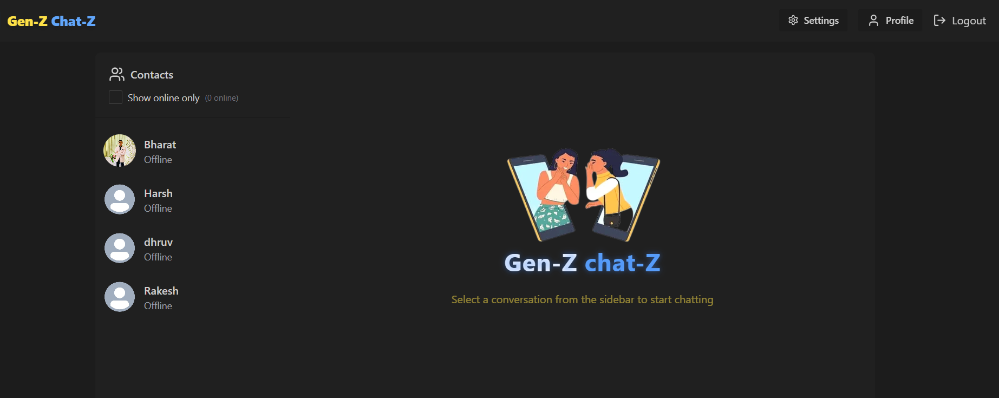

# GEN-Z CHAT-Z CHAT APPLICATION

The Chatting Application is a full-stack, real-time messaging platform developed using the MERN stack (MongoDB, Express.js, React.js, Node.js). It allows users to engage in one-on-one conversations with real-time updates, secure authentication, and media sharing capabilities. This application is designed to provide a seamless user experience similar to modern messaging platforms.


## Screenshots




## Tech Stack Used

- Frontend: React.js, Zustand (state management), Axios (API calls)

- Backend: Node.js, Express.js

- Database: MongoDB (NoSQL database for storing user and chat data)

- Real-time Communication: Socket.io (WebSocket protocol)

- Image Uploads: Cloudinary (for uploading and storing images)

- Authentication: JWT (JSON Web Tokens) for secure login and authorization
## Features

- ✅ User Authentication: Secure login/register using JWT-based authentication.

- 💬 One-on-One and Group Chats: Users can initiate direct messages or create group chats.

- 🔄 Real-Time Messaging: Messages are instantly delivered using Socket.io.

- 🖼️ Image Sharing: Users can upload and send images in chat via Cloudinary integration.

- 🔔 Typing Indicators: Real-time typing notifications for better engagement.

- 🟢 Online Status: Show active users in real time.

- 📂 Persisted Chat History: Chats and messages are stored in MongoDB and available on reload.


## Installation

📁 Clone the Repository

```bash
  git clone https://github.com/dhruvjain23/GenZ-Chat-application.git
  cd chat-app
```

📦 Install Dependencies
1. Backend
```bash
    cd backend
```
```bash
    npm install
```
- Create a .env file in the backend directory and add the following environment variables:
```bash
PORT=8000
MONGO_URI=your_mongodb_connection_string
JWT_SECRET=your_jwt_secret
CLOUDINARY_CLOUD_NAME=your_cloud_name
CLOUDINARY_API_KEY=your_api_key
CLOUDINARY_API_SECRET=your_api_secret
```
- Run the backend server:
```bash
npm run dev
```

2. Frontend Setup
- Open a new terminal and navigate to the frontend folder:
```bash
cd ../frontend
```
- Install frontend dependencies:
```bash
npm install
```
- Run the frontend development server:
```bash
npm run dev
```
3. ✅ Project is Running
- Frontend: http://localhost:5173

- Backend: http://localhost:8000 || Your Backend Port Number

  
## Star the Repo

If You find the project usefull and learning one , please star ⭐ the repo.
Thank You ❤️


    
